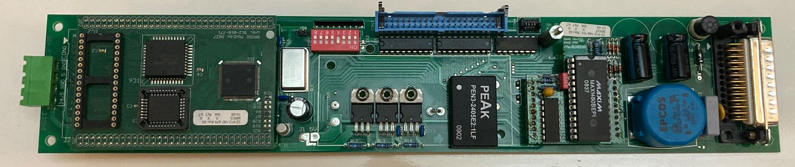
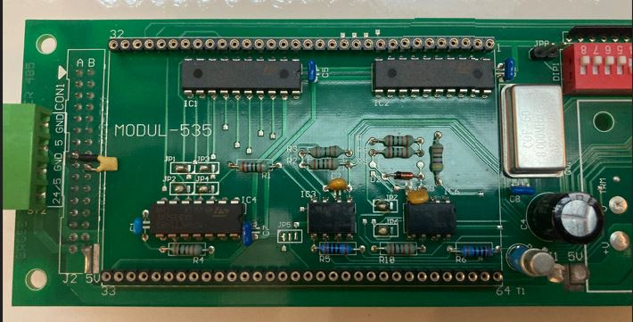
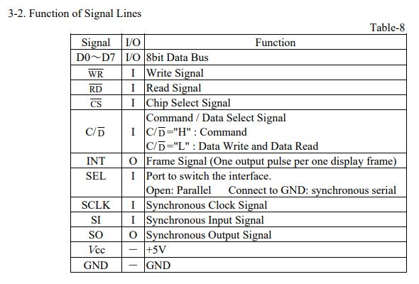
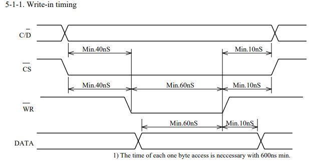
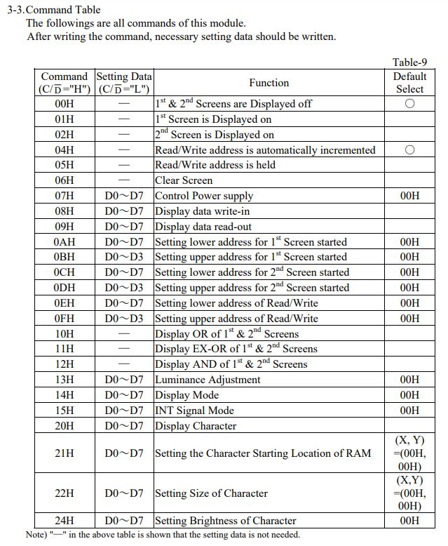
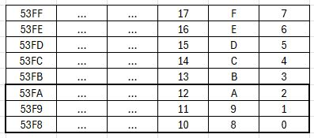

# Futaba-VFD

## About
THis repo documents my progress towards controlling a Futaba VFD (GP1058A03). These displays were used in older train models in switzerland to indicate upcoming stops.

## Datasheet
I could not find a datasheet for the specific model of VFD. However, the datasheet for a different model of VFD (GP9002A01A) was very helpful to me ([Mouser](https://www.mouser.ch/ProductDetail/Futaba/GP9002A01A?qs=P1JMDcb91o7t2Tjm6t%2FvhQ%3D%3D&srsltid=AfmBOorSznqB-2h8J0frFgcTbIMfgcLTwlt7YdGSr8RNrMZZWhgJnwNu)). The description of the pins, the timing diagrams as well as the command list seem to be the same for both displays.

## Hardware
The display is controlled by a board manufactured by BROSE

This board handles the RS-485 communication with the train system as well as the communication with the display. I decided to remove the small daughterboard on the left but keep the main control board. Removing the daughterboard reveals two rows of 32 pin sockets, the backside of the display connector (Labeled 'A B') as wells as two M74HCT45 octal bus transceivers. The M74HCT45 on the left handles the control lines for the display, the one on the right the datalines.

### Pinout
The pins are labeled from 1 to 64, starting in the top right. Most of the pins seem not needed and are not connected through to the display. 
| Nr. | Name | Nr. | Name | Nr. | Name | Nr. | Name |
|-----|-------------|-----|-------------|-----|-------------|-----|-------------|
| 1 | +5V | 17 | ?? | 33 | +5V | 49 | ??|
| 2 | D0 | 18 | CS | 34 | ??| 50 | ??|
| 3 | D1 | 19 | WR | 35 | ??| 51 | ??|
| 4 | D2 | 20 | UKN0 | 36 | ??| 52 | ??|
| 5 | D3 | 21 | UKN1 | 37 | ??| 53 | ??|
| 6 | D4 | 22 | C/D | 38 | ??| 54 | ??|
| 7 | D5 | 23 | UNK2 | 39 | ??| 55 | ??|
| 8 | D6 | 24 | INT | 40 | ??| 56 | ??|
| 9 | D7 | 25 | DIR | 41 | ??| 57 | ??|
| 10 | GND | 26 | ?? | 42 | ??| 58 | ??|
| 11 | GND | 27 | ?? | 43 | ??| 59 | ??|
| 12 | GND | 28 | ?? | 44 | ??| 60 | ??|
| 13 | ?? | 29 | ?? | 45 | ??| 61 | ??|
| 14 | ?? | 30 | ?? | 46 | ??| 62 | ??|
| 15 | ?? | 31 | ?? | 47 | ??| 63 | ??|
| 16 | ?? | 32 | GND | 48 | ??| 64 | GND|

 
 Most of the pins are described in the linked datasheet above:

 

Missing is DIR, which controls the direction of the data lines M74HCT45 (High to send data to the display).
I don't know the functions of **UNK0 - UNK2** yet, i suspect 2 of them are SEL and RD. Pulling them all to +5V has worked for me.

### Communication with the display

## Initialization
For me, the following initialization sequence has worked:

| Step | Command | Data | Description |
|------|---------|------|-------------|
| 1 | 07H | 0H | Power ON |
| 2 | 14H | 10H | Set display to no gray scale mode |
| 3 | 06H | - | Clear screen |
| 4 | 0AH | 0H | set lower addres of first screen to 0 |
| 4 | 0BH | 0H | set higher addres of first screen to 0 |
| 5 | 01H | - | enable first screen |
| 6 | 04H | - | auto increment memory address when writing |
| 7 | 0EH | 0H | set lower addres of write position to 0 |
| 8 | 0FH | 0H | set higher addres of write position to 0 |
| 9 | 08H | 2688x 1 byte | send actual display data |

### Memory layout

The screens memory is 21’504 bytes big and organized the following way:

 

 The numbers indicate the offset from the start position of the write and the thick outline shows the visible part of the screen. (controlled via command)
